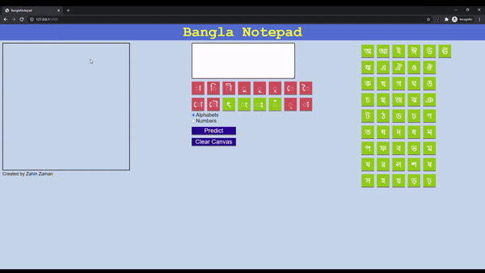

# BanglaNotepad: a smart notepad that incorporates AI to recognize Bengali handwriting
This is a project currently under construction.
## Character Recognition
Currently this is the only aspect of the project that's initiated. It can identify (with around 90-95%-ish accuracy) individual Bengali alphabets and numerals (and special hybrid alphabets with decreased accuracy).
### Training dataset
For numerals, I used the [NumtaDB: Bengali Handwritten Digits](https://www.kaggle.com/BengaliAI/numta) dataset. For alphabets (and special hybrid alphabets), I used the [Ekush: Bangla Handwritten Characters Dataset](https://www.kaggle.com/shahariar/ekush) dataset.  
Unfortunately not all the special hybrid characters were covered in those datasets, and even with the ones covered, the trained model wasn't as accurate as anticipated, simply because hybrid characters tend to look like both of their parent characters. Hybrid character recognition may require some sort of stacked model.  
The data is processed before training. Sigmoid functions are used with appropriate parameters to reduce image noise and highlight strokes.  
Note: dataset is not included in this repository (thanks for blocking my 100MB+ pushes, Github :expressionless:)
### Model
The model has (so far) been trained with Keras under Tensorflow, using a 2-hidden-layer neural network, Adam optimizer and sparse categorical crossentropy for the loss function (all this may change in the future).
```python
model = tf.keras.models.Sequential()
model.add(tf.keras.layers.Flatten())
model.add(tf.keras.layers.Dense(784, activation = tf.nn.relu))
model.add(tf.keras.layers.Dense(392, activation = tf.nn.relu))
model.add(tf.keras.layers.Dense(196, activation = tf.nn.relu))
model.add(tf.keras.layers.Dense(50, activation = tf.nn.softmax))

model.compile(optimizer = "adam", loss = "sparse_categorical_crossentropy", metrics = ["acc"])
model.fit(x_train, y_train, epochs = 8, batch_size = 128)

model.save("alphabets.model", save_format = "h5")
```
### Demo Website
The results of the model can be tested [here](http://banglanotepad.herokuapp.com/).
  
Letters in green have been included in trained model, letters in red have not.
## Next Steps
In order to program accurate predictions, I believe using stacked models is essentials. Next step is to read multiple letters and words from images and process the different letters and words individually. This can be done using stroke detection tools, although may be challenging. Finally I also have plans of incorporating natural language processing for Bengali words and linguistics (but that's way too far ahead for me to think about right now. :stuck_out_tongue: